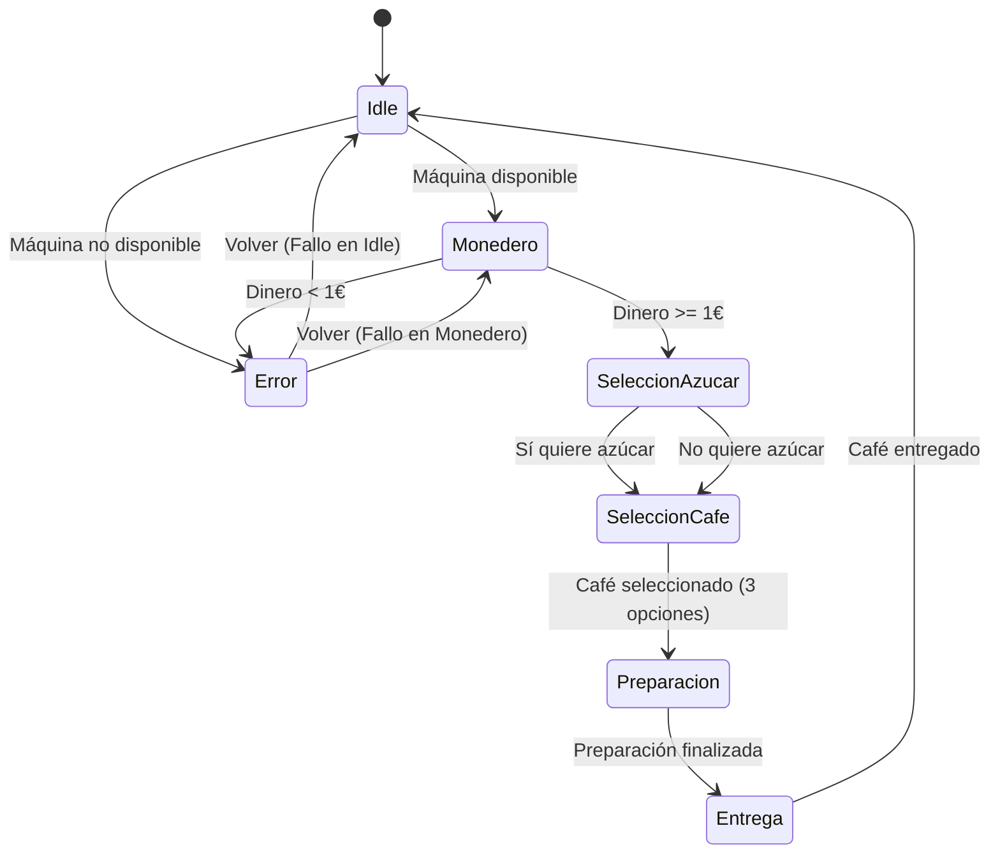

## Máquina de Café 
### Máquina de estados en Kotlin

#### Planteamiento:

Imitar el funcionamiento de la máquina de café del instituto, la cual intentaremos modelar mediante estados.

La máquina de café se divide en:

1º Idle: Estado inicial, donde vemos si la máquina está disponible o no. Si NO está disponible, saltará un mensaje de error y volverá a este estado. Si está disponible, pasaremos al siguiente estado.

2º Monedero: Una vez que la máquina está disponible, pasaremos al estado de monedero, donde se nos pedirá que introduzcamos una cantidad de dinero. Si el dinero introducido es menor a 1€, saltará un mensaje de error y volverá a este estado. Si el dinero introducido es mayor o igual a 1€, pasaremos al siguiente estado.

3º Selección de azúcar: El primer paso se cumple, ahora seleccionaremos si quiere azucar o no. 

4º Opciones de café: Una vez seleccionada la cantidad de azúcar, pasamos a seleccionar el tipo de café. En esta etapa solamente se mostrará los 3 tipos de cafés disponibles a seleccionar.

5º Selección de café: En este estado seleccionamos el tipo de café entre las 3 opciones, una vez seleccionado, pasaremos al siguiente estado.

6º Preparación: Una vez seleccionada la cantidad de azúcar y el tipo de café, la máquina comenzará a preparar nuestro café. Durante este estado, la máquina preparará nuestro café.

7º Entrega: Una vez preparado el café, la máquina nos entregará nuestro café y volverá al estado inicial (Idle).

### Diagrama de Flujo

